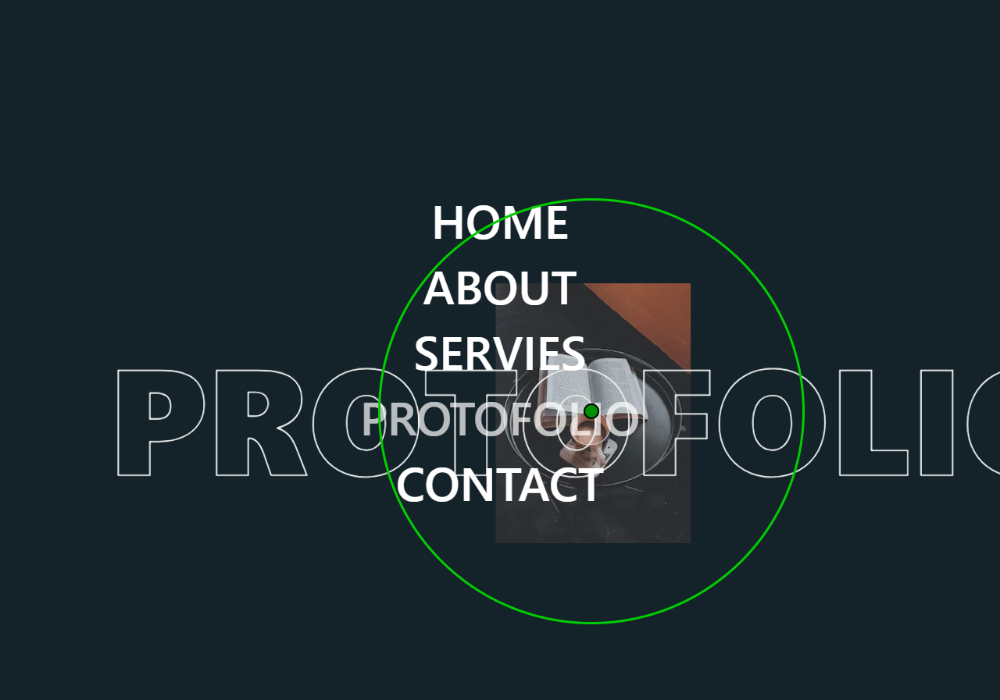

# 🎨 Modern Menu Hover Effects

### A collection of modern and creative hover effects for navigation menus, designed to enhance user experience and add interactive visual feedback to web interfaces.

---

## 📸 Preview

### ✨ Hover Effects Showcase

---

## 🧠 Features

* 🎯 Smooth and modern hover animations
* ⚡ Lightweight and fast الأداء
* 🎨 Multiple hover styles (underline, slide, glow, etc.)
* 🧩 Easy to integrate in any project

---

## 🛠️ Tech Stack

* HTML5
* CSS3 (Transitions, Animations)
* JavaScript (optional for interactions)

---

## 🔥 Use Cases

* Landing pages
* Portfolio websites
* Navigation bars
* UI component libraries

---

## 📌 Future Improvements

* React / Next.js version
* Tailwind CSS integration
* More advanced animation presets
* Accessibility improvements

---

## 🧠 What I Learned

* Creating smooth UI animations باستخدام CSS
* تحسين تجربة المستخدم باستخدام micro-interactions
* تنظيم reusable UI components

---

## 👨‍💻 Author

Ahmed Hassan
Frontend Developer | UI Enthusiast

---

## ⭐ Support

If you like this project, consider giving it a ⭐ on GitHub!
